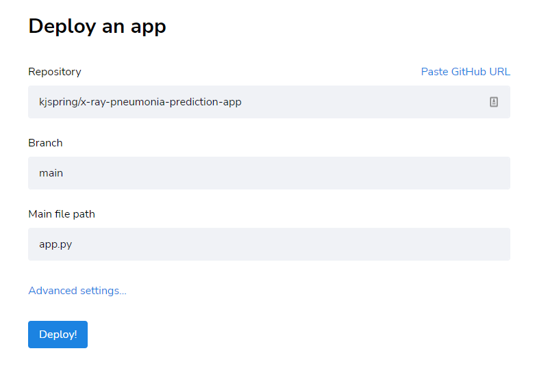
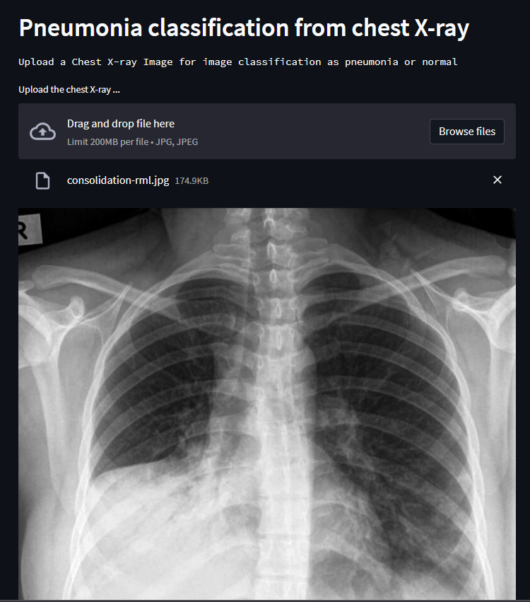

# Pneumonia classification app from chest x-ray

AWS, Flask, Heroku, … the list is long on ways to deploy a data science model, but what if you just need to get something done quickly to show your stakeholders your prototype.

Streamlit is a dream for data scientists that are looking for a way to deploy their data app prototype. It does not take long to set up and it is free to use.

## Installation

In your specific environment install the python steamlit library

```
pip install steamlit
```

## Data

I will use a simple model for binary image classification. The data for training can be found [here (1.2 Gb)](https://drive.google.com/file/d/1__QzvDDuMxaYDhZ1o5A98Pbsk4SlUneV/view?usp=share_link). After downloading the data,

```
from tensorflow.keras.utils import image_dataset_from_directory
import os

# Set path to data in Train_Test_Folder from uncompresss archive
data_path = os.path.join(os.path.abspath(os.getcwd()),'Train_Test_Folder/')
train_dir = os.path.join(data_path, 'train/')
test_dir = os.path.join(data_path, 'test/')

# Import data into tensorflow Dataset object
img_height = 240
img_width = 240
grayscale = 1
batch_size = 64

train_ds, val_ds = image_dataset_from_directory(train_dir,
                                        color_mode='grayscale',
                                        label_mode='binary',
                                        validation_split=0.2,
                                        subset='both',
                                        seed=42,
                                        image_size=(img_height, img_width),
                                        batch_size = batch_size)


test_ds = image_dataset_from_directory(test_dir,
                                       shuffle=False,
                                       color_mode='grayscale',
                                       label_mode='binary',
                                       image_size=(img_height, img_width)
                                      )
```

## Model

I will train a simple convolutional neural network over this data. As I am interested in limiting false positives, I will keep track of sensitivity as well as accuracy.

```
from tensorflow.keras.models import Sequential
import keras
from keras.layers import Conv2D
from keras.layers import MaxPooling2D
from keras.layers import Flatten
from keras.layers import Dense
from keras.layers import Rescaling

batch_size = 64
learning_rate = 5e-4 #1e-3 #3e-4
epochs = 30

# Baseline model
inputs = keras.Input(shape=(img_height, img_width, grayscale))
x = Rescaling(1./255)(inputs) # rescale the images between 0 to 1
x = Conv2D(filters=32, kernel_size=3, activation='relu')(x)
x = MaxPooling2D(pool_size=2)(x)
x = Flatten()(x)
outputs = Dense(1, activation='sigmoid')(x)
model_baseline = keras.Model(inputs=inputs, outputs=outputs, name='baseline_model')

# Compile the Neural network
model_baseline.compile(optimizer = keras.optimizers.Adam(learning_rate), 
                        loss = 'binary_crossentropy',
                        metrics = ['accuracy', 
                                   keras.metrics.SensitivityAtSpecificity(0.9)])

# Save model at best point
callbacks = [
    keras.callbacks.ModelCheckpoint(
        filepath='models/keras/model4.keras',
        save_best_only=True,
        monitor='val_loss')
        ]

# Train the model over the training data
model_baseline_fit = model_baseline.fit(train_ds,
                                         epochs=epochs,
                                         validation_data = val_ds,
                                         batch_size=batch_size,
                                         callbacks=callbacks)
```

## Deployment

The best model is saved in models/keras as model4.keras. In my example I have saved this with the necessary files for deployment in a Github repository.

The other files needed for deployment include the files app.py, setup.sh, img_classification.py, and Procfile.

*app.py*

This file controls the web application. It displays the title, header, and text of the webpage. It also controls the image upload. This will then be sent to the teachable_machine_classification function found in img_classification.py. This function will return a probability of the x-ray indicating the patient has pneumonia (1) or is normal (0). Probabilities greater than 0.5

```
import streamlit as st
from img_classification import teachable_machine_classification
from PIL import Image

st.title("Pneumonia Detection in Chest X-ray EDUCATIONAL USE ONLY")
st.header("Pneumonia classification from chest X-ray")
st.text("Upload a Chest X-ray Image for image classification as pneumonia or normal")

uploaded_file = st.file_uploader("Upload the chest X-ray ...", type=["jpg", "jpeg"])
if uploaded_file is not None:
    image = Image.open(uploaded_file)
    st.image(image, caption='Uploaded Chest X-ray.', use_column_width=True)
    st.write("")
    st.write("Classifying...")
    label = teachable_machine_classification(image, 'model4.keras')
    if label > 0.5:
        st.write("The chest X-ray indicates pneumonia")
    else:
        st.write("The chest X-ray is normal")
```

*img_classification.py*

This file returns a prediction on the probability that the image shows pneumonia (case 1).

```
def teachable_machine_classification(img, weights_file):

    import keras
    from tensorflow.keras.utils import load_img, img_to_array
    from PIL import Image, ImageOps
    import numpy as np
    
    # Load the model
    model = keras.models.load_model(weights_file)
    
    # Construct the tensor that .predict is expecting
    image = ImageOps.fit(img, (128,128), Image.ANTIALIAS)
    image = ImageOps.grayscale(image) # grayscale only images
    image = img_to_array(image) # convert image to array
    data = np.expand_dims(image, axis=0)#/255 # normalize
    
    # get the prediction
    prediction = model.predict(data, verbose=0)
    return prediction #np.argmax(prediction) # return position of the highest   
                                             # probability

```

*requirements.txt*

The requirements file for the web app.

```
numpy==1.23.4
streamlit==1.16.0
pillow
keras
tensorflow-cpu==2.10.0
```

*setup.sh*

This batch file will set up the environment for the web application in Streamlit.

```
mkdir -p ~/.streamlit/
echo "\
[general]\n\
email = \"your@domain.com\"\n\
" > ~/.streamlit/credentials.toml
echo "\
[server]\n\
headless = true\n\
enableCORS=false\n\
port = $PORT\n\
" > ~/.streamlit/config.toml

*Procfile*

```
web: sh setup.sh && streamlit run app.py
```

## Streamlit Setup

If you don’t already have a [Streamlit](https://streamlit.io/) account then sign up and sign into your account. Click on New App and enter the details of your Github repository.




After the app has successfuly been deployed, test your app. You can see my app [here](https://kjspring-x-ray-pneumonia-prediction-app-app-bmt24r.streamlit.app/).


